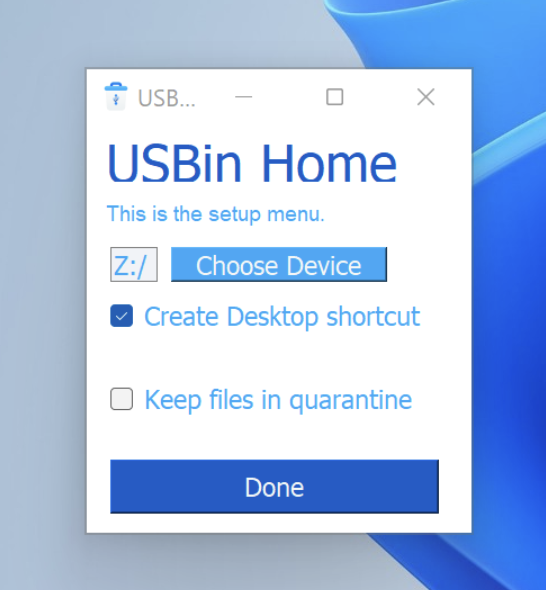
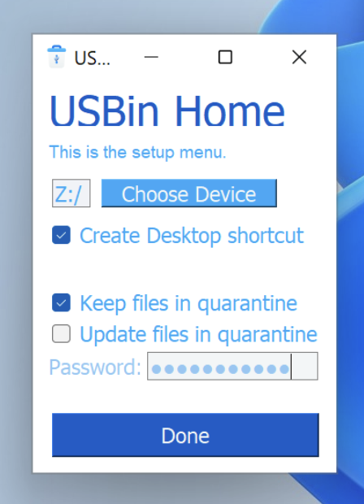

# USBin

A basic Python-made GUI tool to keep all your trash files encrypted and away from your main drive

## Description
This tool allows you to redirect all your deleted files into a wanted drive or folder in order to not use your main disk memory to store useless stuff.
There's the possibility of keeping files in quarantine by a strong AES-256 encryption.
The software is currently only available on Windows


## Getting Started

### Usage
Start the program (it's portable so don't worry about where you're going to put it)
<br>

<br>
Then check all your preferences, if you want to edit the quarantine settings you'll have to write a password 
<br>

<br>
The quarantine can be updated by the specific option, this will put in quarantine all the new files that are inside the destination folder

In order to delete a file you just have to drag it on the program icon/shortcut and it'll do the magic by itself. To do or set everything else, just double click the program icon/shortcut.
The program IS NOT always on in the background since it starts execution when a file is provided and it automatically stops when it does what's needed. 
This makes the script extremely lightweight and safe.


### Self compiling
#### Dependencies

* Needed Python 3.x
* PySimpleGUIQt & pyAesCrypt
* Works on Windows 

#### Download
How to install the program
 ```
 C:\> git clone https://github.com/aledipa/USBin.git
 C:\> cd USBin/
 ```
How to install the needed dependencies
```
 C:\> py -m pip install --upgrade pip
 C:\> py -m pip install PySimpleGUIQt
 C:\> py -m pip install pyAesCrypt
```
Or even
```
 C:\> pip3 install PySimpleGUIQt
 C:\> pip3 install pyAesCrypt
```
#### Windows compiling
You can use whichever Python "compiler" you want, but I used PyInstaller
 ```
 C:\> py -m pip install --upgrade pip
 C:\> py -m pip install PyInstaller
 ```
 Then i used the following flags
  ```
 C:\> py -m PyInstaller USBin.py --onefile --windowed --clean --icon USBin.ico
 ```

## Help

If executing errors are raised in the self-compiled version, try to update your python version or feel free to open an issue
```
# Check your python version (should be at least 3.0)
 C:\> py -v
```
If you encountered issues on the pre-compiled release, please open an issue stating what happened


## Version History

* v1.1
    * First Update (bug fix)
    * See [commit change](https://github.com/aledipa/USBin/commits/main) or See [release history](https://github.com/aledipa/USBin/releases)

* v1.0
    * Initial Release
    * See [commit change](https://github.com/aledipa/USBin/commits/main) or See [release history](https://github.com/aledipa/USBin/releases)

## Contributing
Pull requests are welcome. For major changes, please open an issue first to discuss what you would like to change.

Please make sure to update tests as appropriate.

## Notes
This little project aims to be a working proof of concept that is able to be used by whoever could be interested in this kind of idea. The development is very basilar and highly customizable.
Right now the program is only supported on Windows, but the platform compatibility could easily be extended to MacOS and Linux.
Take this project as it is and, if you want to, make it better.

